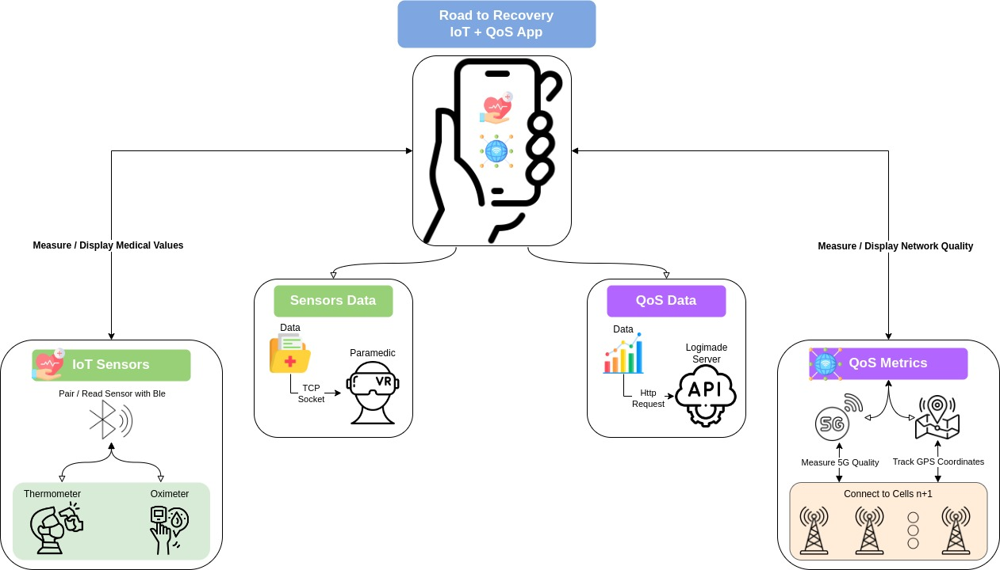

# Mobile App for Patient Data and Network Metrics

The mobile app, developed using Kotlin for Android devices, is designed to collect and transmit patient data and network performance metrics. The app integrates with BewellConnect IoT sensors and monitors 5G network quality, with data sent to a server and the Paramedic AR app.

## Components

The mobile app comprises two major components: **IoT Sensor Integration** and **Quality of Service (QoS) Monitoring**, as illustrated in [Diagram](#diagram).

### IoT Sensor Integration

- **Purpose**: This component interfaces with two types of Internet of Things (IoT) sensors: a pulse oximeter and a thermometer.

- **Functionality**: It establishes a connection with these sensors using Bluetooth Low Energy (BLE) technology. The app reads data from the sensors, including measurements of blood oxygen levels and body temperature.

- **Data Transmission**: After collecting the sensor data, the app uses a TCP socket connection to send this information to the Paramedic Augmented Reality (AR) app. This real-time data transmission allows the Paramedic AR app to receive and display the patient's vital signs, aiding in immediate medical assessment and decision-making.

### Quality of Service (QoS) Monitoring

- **Purpose**: This component is designed to monitor and report on the quality of the 5G network connection used by the mobile app.

- **Functionality**: It connects to multiple network cells to measure various aspects of 5G signal quality, including signal strength, connection stability, and data throughput.

- **Data Collection**: Along with the signal quality metrics, the app records the timestamp and GPS coordinates. This information provides context for the network performance data, helping to understand how network quality varies with location and time.

- **Data Transmission**: The collected QoS data is sent to an API hosted on the Logimade server. This data is analyzed to assess network performance and reliability during the ambulance’s journey, ensuring that the connection remains stable for the transmission of critical data.

## Diagram



*Figure X1: Overview of the mobile app components, including IoT Sensor Integration and Quality of Service (QoS) Monitoring.*

## Installation

1. **Clone the repository**:
   ```sh
   git clone https://github.com/yourusername/your-repo-name.git

2. **Open the project in Android Studio.**
3. **Build and run the app** on an Android device or emulator.

## Configuration

- **IP Address Configuration**: To send data to the Paramedic AR app, enter the IP address of the VR device within the app settings.

## Usage

- **Sensor Integration**: Connect the BewellConnect IoT sensors to the app via BLE.
- **View Measurements**: After capturing measurements, view the sensor values directly on the app.
- **Data Upload**: The app automatically uploads data to the server and the Paramedic AR app based on the configured IP address.

## Foreground Services

- **Network Metrics Service**: Automatically starts on app launch and records network metrics, GPS coordinates, and timestamps using the [NetMonster library](https://github.com/mroczis/netmonster-core).
- **GPS Tracking Service**: Continuously tracks and records GPS coordinates.
- **API Request Service**: Performs periodic checks of the local database every 3 minutes and uploads new records to the server using Retrofit if any new data is available.

